# README for Climate Agriculture Impact

## Introduction

This project analyzes real-world climate, agriculture, CO₂ emission, and healthy diet datasets. The project looks to visualize and explore these datasets in concise and informative streamlit app.

This app (climate-app) will be hosted on Google Cloud Run here:

https://climate-app-670584475490.northamerica-northeast2.run.app/

           

## Data

The data for this project comes from several different sources:

First a very large dataset from Our World in Data (OWID: https://ourworldindata.org/) the shows global CO₂ emissions since the year 1750. This contains data from every country in the world, it's a large CSV file that was downloaded directly from the site (full citation in [References](#references)).

              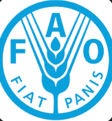

The next dataset comes from the Food and Agriculture Organization and World Bank (World Bank: https://data.worldbank.org/). This dataset shows the affordability of a healthy diet globally. It shows how many people are able to afford a healthy diet in each country. This was another CSV file downloaded directly from the site (full citation in [References](#references)).

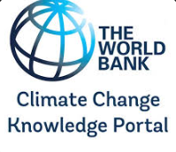

The next dataset also comes from the World Bank but also the Climate Change Knowledge Portal (CCKP: https://climateknowledgeportal.worldbank.org/). This CSV was obtained through an API request, looking for a timeseries of annual rainfall from 1908-2024. The specific API request in found in the `main_backup.ipynb` or `CCKP_rainfall_data.ipynb` notebooks of this repo. A full citation come be found in [References](#references).

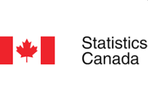     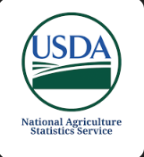

Finally datasets of crop production of Canada and the United States of America were found at Statistics Canada (Stats Can: https://www.statcan.gc.ca/en/start) and the United States Department of Agriculture Quick Stats (USDA Quick Stats: https://www.nass.usda.gov/Quick_Stats/). These two datasets contains information on historical wheat and corn production that was used for this project. A full citation come be found in [References](#references).

## Methodology

Initial research centered on climate and agriculure datasets. This project consists of real-world data compiled from many sources (World Bank, OWID, FAO, USDA, etc. ) to a single PostgreSQL database hosted on RDS.

 

After initial research, an extensive ETL (extract, transform, load) and EDA (exploratory data analysis) stage began in VSCode by loading the datasets to with pandas to a jupyter notebook `.ipynb` file.

Here each dataset was loaded into a single large notebook file to explore the data.

Example (OWID):

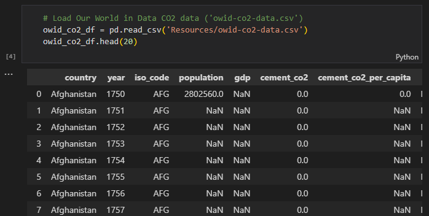

Key columns were identified and unneccesary columns were dropped. However, this was still a preliminary and exploratory stage and final decisions were not made at this point. The purpose of this stage was to get to know the data, wide commonalities and decide how best to correlate the different datasets and coalesce them into a single database.

Example (OWID):

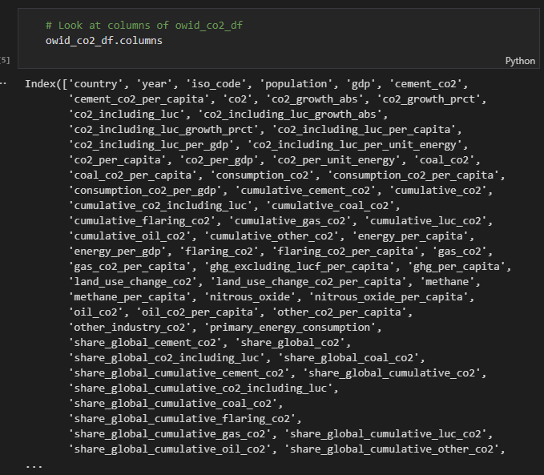

It was decided that the maximum range for this database would be the years 1908-2024. Some datasets contained much more than that, others much less. This date range was chosen to explore as much data as possible without overreaching.

Once all the datasets were successfully loaded into pandas, separate smaller `.ipynb` notebooks were created to to continue the ETL process. A full ETL pipeline was considered, however for the purposes of this project a single pipeline was not necessary. A separate notebook was created for each dataset (except for the Stats Can and USDA datasets). The idea was to create smaller single files to avoid a long scrolling single notebook for all the transformations.

List of separate ETL files:

* CCKP rainfall file: `CCKP_rainfall_date.ipynb`
* FAO Healthy Diet Affordability file: `healthy_diet.ipynb`
* OWID CO₂ emissions file: `owid_date.ipynb`
* Stats Can and USDA crop files: `crop_date.ipynb`

The transformations of the datasets involved dropping even more columns, converting units of measurement, casting to appropriate values, renaming columns, among other things to create uniform looking tables.

Examples below (crop table and rainfall table):

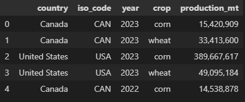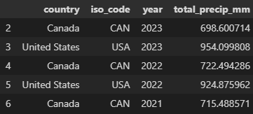

Some visuals were also created to view the data. This served as an exploration of the data, as well as the concept for future visuals within the streamlit app. These interactive visuals were created with ploty express library (with the help of the sklearn library for linear regressions). They are located within the separate ETL files mentioned above (`crop_data.ipynb` , `CCKP_rainfall_data.ipynb` , etc.)

Example (crop and rainfall visuals):

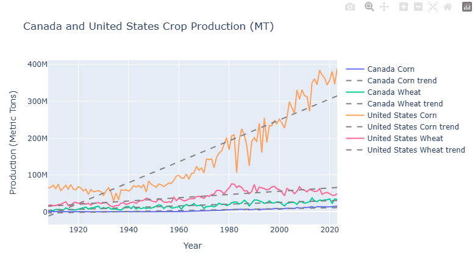

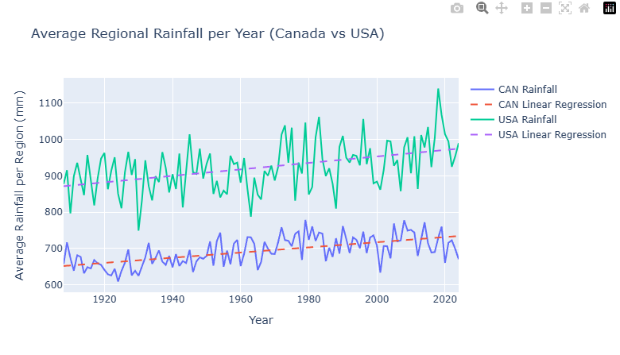

Next the clean uniform tables were all saved the the Output directory of the repository.

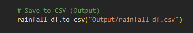

A new `.ipynb` notebook was created (`SQL_upload.ipynb`) to handle the upload to the PostgreSQL database. Before uploading however, and Amazon RDS database was created using AWS UI.

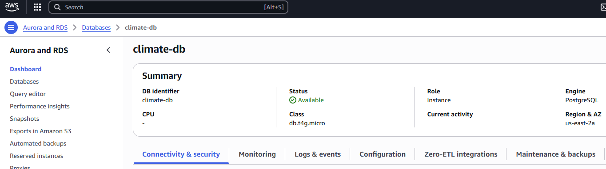

Each table was uploaded to the RDS PostgreSQL database.

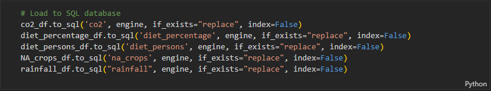

Two major steps remained: creating the streamlit app and pushing the app to Google Cloud Run.

The streamlit app was created in a python script (`.py`) file named `app.py`. Streamlit requires it's own syntax, but it is fairly easy to use and to learn. The app consists of a sidebar with a dropdown menu for each table, a main area with dropdown menus to select columns within the table (and countries, and crops), a visual section, and an SQL playground to make custom SQL queries:

Example (begining of sidebar code):

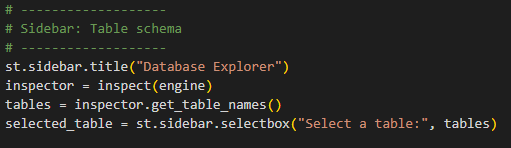

Example (beginning of main area code):

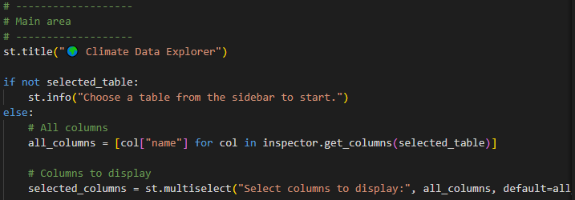

Example (beginning of plotting code):

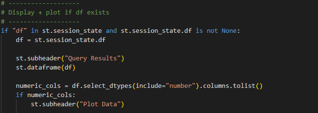

Finally pushing the app to Google Cloud Run so that it could be publicly available. This required creating a Dockerfile, which subsequently required creating a `requirement.txt` file.

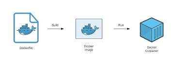

Once the Docker image was created, pushing it to Google Cloud Run required setting up a project with their UI, then pushing the Docker image to the project with Google Cloud SDK:

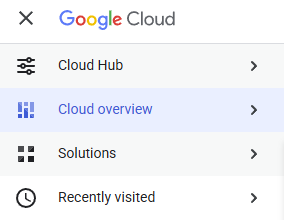

## Results

The result of all that work culminated in a working app: https://climate-app-670584475490.northamerica-northeast2.run.app/

That link was listed in the [Introduction](#introduction) section, and it's the same one here as well.

The app allows users to create their own plots using data from our database. The app allows users to views correlations in (Canada and the United States) between CO₂ emissions, corn and wheat produciton, rainfall, and healthy diets. There are no hard causal links viewed here, however a few things stand out.

##### CO₂ Emissions

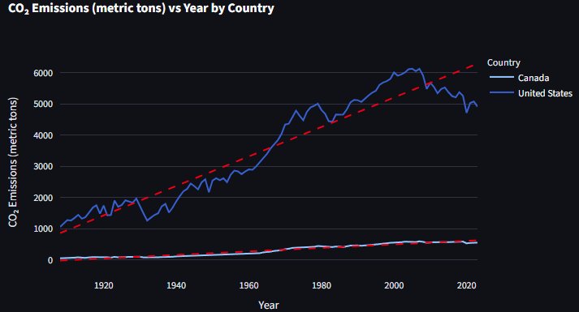

CO₂ emissions have increased greatly in North America in the past century, however the trend in the new millenium is downward. Perhaps efforts to curb emissions have been at least partially successful, or maybe there are other factors at play here.

Although the more recent years show a slight downturn in emissions, the overall trend is still a drastic increase. The linear regressions (red dash lines) show a clear upward direction.

##### Precipitation

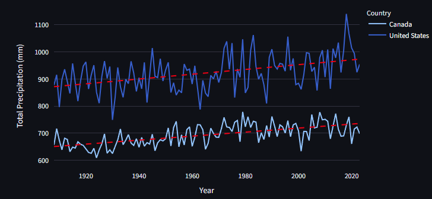

Even though Canada is larger country than the United States, it has less precipitation. This could be because Canada has large dry and cold areas, like the Arctic, which does not have a lot of precipitaion. The United States, on the other hand, is much warmer on average and has very humid areas in the Southeast. The United States also has large rainfall events like hurricanes, of which Canada has relatively fewer.

The average precipitation seems to be increasing, similar to the CO₂ emissions in the previous table. That is a correlation that could be worth investigating.

##### Crops

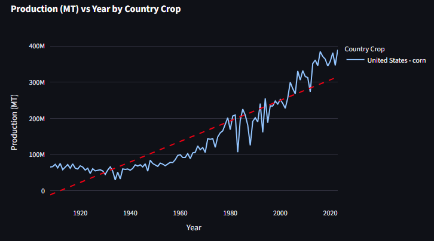

The above shows corn production in the United States. The trend is upward, similar to the CO₂ emissions and precipitation plots above. However, there are many factors involved in crop production (as with CO₂ emissions and precipitation). The up and down nature of the crop yield mirrors the shifts year to year in precipitation. There could be a correlation there.

The overall increase of the corn production could also be related to the GDP of the United States (from CO₂ table):

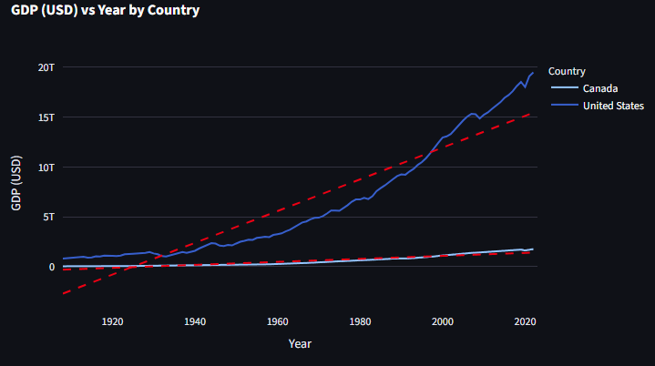

##### Healthy Diet

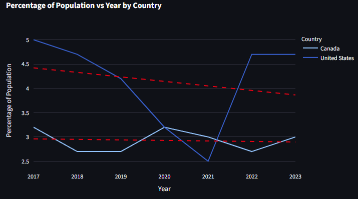

Interestingly, this healthy diet afforadibility table is the only one in this database with a downward trajectory. Compared to the GDP plot above, it's striking to see that as the countries are worth more, it's citizens are on average able to afford less. There's more corn and wheat, more rainfall, the countries are worth more, but still there are more people unable to afford a healthy diet.

Of course there are a myriad of different factors at play here. Not to mention that these diet tables notably have a much smaller date range than the others (2017-2023). In this limited 6 year range, perhaps we're missing the overall trend throughout the century. If we took only the last 6 years of CO₂ emissions, for example, we would see an overall downward trajectory.

## Conclusion

This project successfully created a streamlit app that can visualize key factors in climate and agriculture in North America. This narrow goal was acheived however, a larger scientific analyze of the data has been omitted.

There was no hypothesis to test here: only an examination of some relevant data, collected from a variety of real-world sources, and consolidated here from precursory evaluation.

It's a fun app that can be used as a starting point for some analysis. There are some possible additions that could be made to help:

* a sliding scale for date ranges
* comparison tool for multiple tables
* a larger healthy diet date range
* among many others
* a way to visualize queries from the SQL playground

However, if you are so inclined, you can try your hand at some custom queries in the SQL playground at the bottom of the page. Here you can compare tables using joins, or create your own ranges, or search for whatever specific output you'd like from the database.

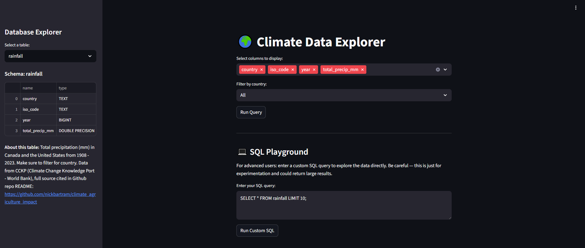

## References

- Our World in Data. *CO₂ Data.* Available at: [https://github.com/owid/co2-data](https://github.com/owid/co2-data)
- World Bank & FAO. *Cost and Affordability of a Healthy Diet (CoAHD).* Available at: [https://data360.worldbank.org/en/dataset/FAO_CAHD](https://data360.worldbank.org/en/dataset/FAO_CAHD)
- World Bank. *Climate Change Knowledge Portal.* Available at: [https://climateknowledgeportal.worldbank.org/download-data](https://climateknowledgeportal.worldbank.org/download-data)
- Statistics Canada. Available at: [https://www150.statcan.gc.ca/t1/tbl1/en/cv.action?pid=3210035901](https://www150.statcan.gc.ca/t1/tbl1/en/cv.action?pid=3210035901)
- USDA. *Quick Stats.* Available at: [https://quickstats.nass.usda.gov/](https://quickstats.nass.usda.gov/)

## Usage

`main.ipynb` contains the initial loading and examination of the files. This notebook file simply checks to see if we can load the data and examines it quickly to see if we can work with it. The project started in this file. A lot of trial and error has been edited out of this file including other datasets that were ultimately excluded. View this file to see initial EDA and research phase of the project.

The main ETL files were stated above in [Methodology](#methodology):

* CCKP rainfall file: `CCKP_rainfall_date.ipynb`
* FAO Healthy Diet Affordability file: `healthy_diet.ipynb`
* OWID CO₂ emissions file: `owid_date.ipynb`
* Stats Can and USDA crop files: `crop_date.ipynb`

These files contain a much more elaborate transformation of the data that in `main.ipynb`. View these files to see the ETL phase of this project, and a little EDA in the form of visualizations.

SQL_upload.ipynb was used to load the tables to a PostgreSQL database and AWS RDS database.

The Docker image was created using `Dockerfile` and `requirements.txt`.

The app itself (located: https://climate-app-670584475490.northamerica-northeast2.run.app/) can be used intuitively.

* use the sidebar to select a table
  * the tables schema and a brief description will display below
* use the first dropdown menu to select with columns to display
* filter by country
  * filter also by crop if using the 'na_crops' table
* hit "Run Query" button
  * a table will display below to your specifications
* use "Line Plot" or "Scatter Plot" buttons to pick either plot
  * optionally check the "Add linear regression trendline" box
* run custom SQL queries of the database using the SQL Playground
* enjoy!
